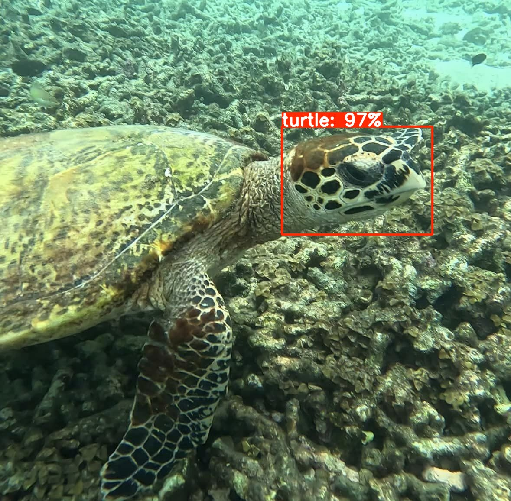
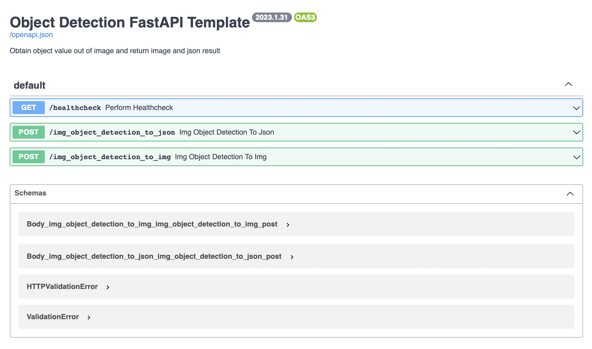

# YOLO11-FastAPI:
docker service that uses YOLOv11 to recognize turtles.

### Sample
Here's a sample of what you can expect to see with this project:


# What's inside:
- YOLOv11: A popular real-time object detection model
- FastAPI: A modern, fast (high-performance) web framework for building APIs
- Docker: A platform for easily building, shipping, and running distributed applications

## Locally
To start the application locally, follow these steps:

1. Install the required packages:

```
pip install -r requirements.txt
```
2. Start the application:
```
uvicorn main:app --reload --host 0.0.0.0 --port 8001
```

## Usage
### Running the Service Locally
To start the service locally, use the following command:

```bash
docker run ghcr.io/iad/tao-turtles-recognition
```
The service will be accessible on port 8001.

### Accessing the Public Service
Alternatively, you can use the publicly available service at:
http://isturtle.iadlab.ru/docs

## FAST API Docs url:
http://0.0.0.0:8001/docs#/

    

---
Special Thanks to [Alex-Lekov/yolov8-fastapi](https://github.com/Alex-Lekov/yolov8-fastapi)